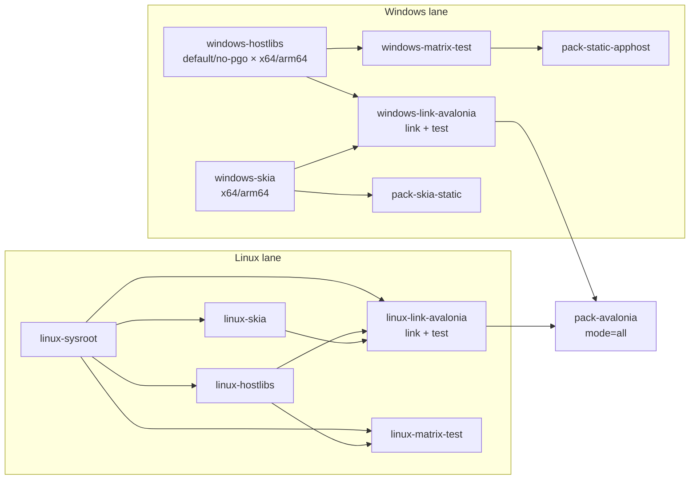

# HostForge 开发与构建指南

本文面向仓库维护者和希望从源码构建 HostForge 的开发者。包的消费方式请从根目录 [README](README.md) 进入对应包文档。

除非特别说明，以下命令都在仓库根目录执行。

## 版本来源

项目只维护一组当前依赖，不提供多版本并行构建矩阵。

- [`DEPS`](DEPS) 保存上游源码版本和 commit，供检出脚本与 CI 缓存键使用。
- [`Directory.Build.props`](Directory.Build.props) 保存 MSBuild、NuGet 依赖及包版本所需的版本号。

升级 Runtime、SkiaSharp 或 HarfBuzzSharp 时，应同步检查这两个文件。当前配置为：

| 依赖 | 版本 |
| --- | --- |
| Avalonia | 12.1.0 |
| .NET Runtime | 10.0.10 |
| SkiaSharp | 3.119.4 |
| HarfBuzzSharp | 8.3.1.5 |

Runtime 与 SkiaSharp 的缓存键包含版本、上游 commit、目标系统、架构和工具链信息。更新 `DEPS` 后会产生新的缓存键，不会错误复用旧版本缓存。

## 环境要求

通用要求：

- .NET 10 SDK
- Python 3.10+
- Git
- Ninja
- CMake
- LLVM / Clang

Windows 构建环境：

- Windows 11
- MSVC Build Tools 14.50（VS 2026）
- Windows SDK 10.0.26100
- LLVM，默认路径为 `C:\Program Files\LLVM`
- 可选 Python 包 `colorama`

Linux 构建使用 Clang，并通过 sysroot 对齐 .NET Host、SkiaSharp 和 HarfBuzzSharp 的目标 ABI。背景和工具链说明见 [Linux 构建方法](docs/roadmap/2026-03-13-linux-build-methodology.md)。

## 检出上游源码

```bash
python scripts/checkout-deps.py runtime
python scripts/checkout-deps.py skiasharp
```

版本来自 `DEPS`，无需也不能通过命令行选择其他版本。源码目录包含版本号：

```text
repo/runtime-<version>
repo/skia-<version>
```

非 CI 环境会使用 `repo/deps-mirror` 保存上游裸仓库缓存。查看当前版本或解析源码目录：

```bash
python scripts/checkout-deps.py --list
python scripts/checkout-deps.py --print-source-dir runtime
python scripts/checkout-deps.py --print-source-dir skiasharp
```

## 构建入口

[`scripts/pipeline.py`](scripts/pipeline.py) 是常用任务入口：

| 命令 | 作用 |
| --- | --- |
| `hostlibs` | 构建 .NET AppHost / SingleFileHost 静态库 |
| `skia` | 构建 SkiaSharp / HarfBuzzSharp 静态库 |
| `matrix` | 运行通用 Static AppHost 构建集成矩阵 |
| `link-avalonia` | 生成指定操作系统的 Avalonia 宿主模板 |
| `avalonia-test` | 运行 Avalonia AppHost 集成测试 |
| `pack-avalonia` | 打包 Avalonia AppHost |
| `pack-static-apphost` | 打包通用 Static AppHost |
| `pack-skia-static` | 打包 SkiaSharp 静态库输入 |

运行子命令的 `--help` 可查看平台、RID 或打包模式参数。

## Windows 构建

### 1. 构建 HostLibs

```powershell
python .\scripts\pipeline.py hostlibs -v
```

Windows 下该命令构建以下组合：

- `default`：`win-x64`、`win-arm64`
- `no-pgo`：`win-x64`、`win-arm64`

也可以单独调用底层脚本：

```powershell
python .\scripts\build-hostlibs.py all -v --arch x64
python .\scripts\build-hostlibs.py all -v --arch arm64
python .\scripts\build-hostlibs.py all -v --arch x64 --no-pgo
python .\scripts\build-hostlibs.py all -v --arch arm64 --no-pgo
```

在同一份 Runtime 工作树中切换 `default` 和 `no-pgo` 前，需要清理对应 subset 的中间产物。例如当前 Runtime 版本的 x64 工作树：

```powershell
.\repo\runtime-10.0.10\build.cmd -clean -subset host.native -c Release -a x64
.\repo\runtime-10.0.10\build.cmd -clean -subset clr.runtime -c Release -a x64
```

CI 的不同 flavor 位于独立 runner，不受此问题影响。

### 2. 构建 SkiaSharp / HarfBuzzSharp

```powershell
python .\scripts\pipeline.py skia -v
```

或按架构构建：

```powershell
python .\scripts\build-skia-harfbuzz.py -v --arch x64 --os windows
python .\scripts\build-skia-harfbuzz.py -v --arch arm64 --os windows
```

### 3. 生成并验证 Avalonia 宿主

```powershell
python .\scripts\pipeline.py link-avalonia -v --os windows
python .\scripts\pipeline.py avalonia-test -v
```

`avalonia-test` 会按需打包平台包，并验证模板激活、动态本机库抑制和可执行文件运行行为。

### 4. 打包

```powershell
python .\scripts\pipeline.py pack-avalonia -v --mode windows
python .\scripts\pipeline.py pack-static-apphost -v --rid win-x64
python .\scripts\pipeline.py pack-skia-static -v --rid win-x64
```

`pack-avalonia --mode windows` 会在打包前自动链接 Windows 模板。`--mode all` 不执行链接，仅用于聚合已经生成或下载的 Windows 与 Linux 模板；详细约定见 [Avalonia 打包说明](src/package-avalonia-apphost/DEVELOPMENT.md)。

## Linux 构建

Linux 构建目前以 `linux-x64` 为主，并使用 `ROOTFS_DIR` 指向目标 sysroot。

### 1. 构建 HostLibs

```bash
ROOTFS_DIR=repo/rootfs/x64 \
  python scripts/build-hostlibs.py -v --os linux --arch x64
```

### 2. 构建 SkiaSharp / HarfBuzzSharp

```bash
CC=clang CXX=clang++ ROOTFS_DIR=repo/rootfs/x64 \
  python scripts/build-skia-harfbuzz.py -v --os linux --arch x64
```

### 3. 生成并验证 Avalonia 宿主

```bash
python scripts/pipeline.py link-avalonia -v \
  --os linux \
  --sysroot repo/rootfs/x64

python scripts/pipeline.py avalonia-test -v \
  --sysroot repo/rootfs/x64
```

### 4. 验证通用链接流程

```bash
dotnet run --project samples/simple-pinvoke/SimplePInvoke.csproj
dotnet publish samples/simple-pinvoke/SimplePInvoke.csproj -p:PublishTrimmed=true
```

## 测试

通用 Static AppHost 集成矩阵：

```powershell
python .\scripts\pipeline.py matrix -v
```

可通过环境变量调整矩阵测试：

- `HOSTFORGE_MATRIX_SKIP_EXE_RUN=true`：只构建，不运行生成的可执行文件。
- `HOSTFORGE_MATRIX_NO_CLEAN=true`：保留消费端测试项目的 `bin` / `obj`。

也可以直接运行测试工程：

```powershell
dotnet test --project .\tests\HostForge.StaticAppHost.Tests\HostForge.StaticAppHost.Tests.csproj -c Release -v:minimal
dotnet test --project .\tests\HostForge.AvaloniaAppHost.Tests\HostForge.AvaloniaAppHost.Tests.csproj -c Release -v:minimal
```

Avalonia 测试包含平台特定用例：Windows 用例在非 Windows 系统跳过，Linux 用例在非 Linux 系统跳过。

## 产物布局

```text
artifacts/
├── hostlibs/<runtime-version>/<flavor>/<rid>/
├── skiasharp/<skiasharp-version>/<rid>/
├── avalonia-host/<avalonia-target>/<rid>/
├── packages/<configuration>/
└── tmp/
```

主要目录：

- `hostlibs`：AppHost / SingleFileHost 静态库、响应文件和链接参数。
- `skiasharp`：SkiaSharp / HarfBuzzSharp 及其依赖静态库。
- `avalonia-host`：已经链接完成、可直接打包的宿主模板。
- `packages`：生成的 NuGet 包。
- `tmp`：集成测试工作区和临时 NuGet 缓存。

## CI 工作流

<!-- Keep this Mermaid workflow diagram in sync with .github/workflows/build.yml. -->


| Job | 平台 | 主要输出 |
| --- | --- | --- |
| `windows-hostlibs` | Windows | 两种 flavor、两种架构的 HostLib 缓存 |
| `windows-skia` | Windows | `win-x64` / `win-arm64` Skia 缓存 |
| `windows-matrix-test` | Windows | Static AppHost 集成验证 |
| `windows-link-avalonia` | Windows | Windows Avalonia 模板及测试结果 |
| `pack-static-apphost` | Windows | Static AppHost NuGet 包 |
| `pack-skia-static` | Windows | SkiaSharp Static NuGet 包 |
| `linux-sysroot` | Linux | Linux sysroot 缓存 |
| `linux-hostlibs` | Linux | `linux-x64` HostLib 缓存 |
| `linux-skia` | Linux | `linux-x64` Skia 缓存 |
| `linux-matrix-test` | Linux | Static AppHost 集成验证 |
| `linux-link-avalonia` | Linux | Linux Avalonia 模板及测试结果 |
| `pack-avalonia` | Windows | 聚合 Windows / Linux 模板的 Avalonia NuGet 包 |

## 缓存约定

CI 中 `actions/cache` 以 `artifacts/hostlibs` 或 `artifacts/skiasharp` 为缓存根目录，具体版本和 RID 位于其子目录。

缓存键由 [`scripts/cache_key.py`](scripts/cache_key.py) 生成：

- Runtime：系统、架构、版本、flavor、上游 commit，以及 Windows MSVC 或 Linux Clang 版本。
- SkiaSharp：系统、架构、版本、上游 commit，以及 Windows MSVC/Clang 或 Linux Clang/GCC 版本。

构建 job 使用 `lookup-only` 查询缓存；miss 时完成构建，并由 cache action 的 post step 保存输出。下游链接、测试和打包 job 使用同一缓存键恢复产物。

## 仓库结构

```text
src/        MSBuild 链接逻辑和三个包工程
scripts/    依赖检出、原生构建、缓存键和流水线入口
samples/    Avalonia 与简单 P/Invoke 示例
tests/      TUnit 集成测试及共享测试基础设施
docs/       设计、方法论和路线文档
repo/       上游源码、镜像缓存、sysroot 和补丁
artifacts/  构建、打包和测试输出
```

更具体的测试说明分别位于：

- [Static AppHost tests](tests/HostForge.StaticAppHost.Tests/README.md)
- [Avalonia AppHost tests](tests/HostForge.AvaloniaAppHost.Tests/README.md)
- [Test infrastructure](tests/HostForge.TestInfra/README.md)
