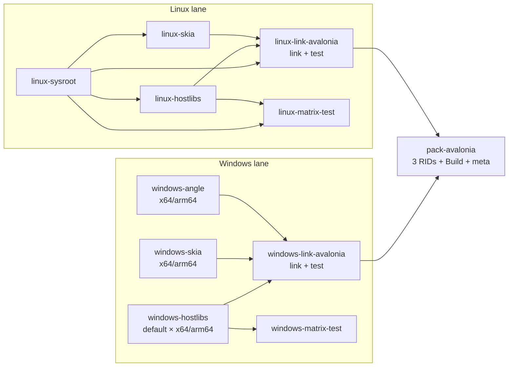

# HostForge 开发与构建指南

本文面向仓库维护者和希望从源码构建 HostForge 的开发者。包的消费方式请从根目录 [README](README.md) 进入对应包文档。

除非特别说明，以下命令都在仓库根目录执行。

## 版本来源

- [`native/hostlibs`](native/hostlibs)
- [`native/skiasharp`](native/skiasharp)
- [`native/angle`](native/angle)
- [`Directory.Build.props`](Directory.Build.props)


## 环境要求

通用要求：

- .NET 10 SDK
- Python 3.10+
- [uv](https://docs.astral.sh/uv/)
- Task 3.52.0+
- Git
- Ninja
- CMake
- LLVM / Clang

Windows 构建环境：

- Windows 11
- MSVC Build Tools 14.50（VS 2026）
- Windows SDK 10.0.26100
- [LLVM](https://github.com/llvm/llvm-project/releases/download/llvmorg-21.1.8/LLVM-21.1.8-win64.exe) ，默认路径为 `C:\Program Files\LLVM`
- [depot_tools](https://chromium.googlesource.com/chromium/tools/depot_tools.git) ，配置环境变量

Linux 构建使用 Clang，并通过 sysroot 对齐 .NET Host、SkiaSharp 和 HarfBuzzSharp 的目标 ABI。背景和工具链说明见 [Linux 构建方法](docs/roadmap/2026-03-13-linux-build-methodology.md)。

## 上游源码

无需预先检出上游仓库。Conan 在首次构建 recipe revision 时浅检出固定 commit，并将配置无关的源码保存在 source cache；每个 binary configuration 使用独立 build folder。ANGLE 和 SkiaSharp 的 GN 输出位于外部 build folder，Runtime 则为每个 binary 使用隔离的源码副本，避免不同架构或 PGO flavor 共用 Runtime `artifacts/obj`。

## 构建入口

根目录 [`Taskfile.yml`](Taskfile.yml) 是常用任务入口：

| 命令 | 作用 |
| --- | --- |
| `build-hostlibs` | 构建 .NET AppHost / SingleFileHost 静态库 |
| `build-skiasharp` | 构建 SkiaSharp / HarfBuzzSharp 静态库 |
| `build-angle` | 构建 Windows x64 / arm64 ANGLE 静态库 |
| `matrix` | 运行通用 Static AppHost 构建集成矩阵 |
| `link-avalonia` | 生成指定操作系统的 Avalonia 宿主模板 |
| `avalonia-test` | 运行 Avalonia AppHost 集成测试 |
| `pack-avalonia` | 打包全部 Avalonia AppHost（RID 包 + Build + 元包） |
| `pack-avalonia-rid` | 打包单个 RID 的 Avalonia AppHost 模板（RID=win-x64\|win-arm64\|linux-x64） |
| `pack-avalonia-build` | 打包 Build 包（targets + ModuleInitializer） |
| `pack-avalonia-meta` | 打包元包（依赖所有子包） |
| `pack-static-apphost` | 打包通用 Static AppHost |
| `pack-skia-static` | 打包 SkiaSharp 静态库输入 |

运行 `task --list` 可查看任务；通过 `NAME=value` 传入目标平台、RID 或打包模式。构建任务接受 `ARCH=x64|arm64`、`PGO=true|false`，Linux 构建还需传入 `SYSROOT`。

## Windows 构建

### 1. 构建 HostLibs

Windows 支持以下组合：

- `default`：`win-x64`、`win-arm64`
- `no-pgo`：`win-x64`、`win-arm64`

```powershell
task build-hostlibs ARCH=x64
task build-hostlibs ARCH=arm64
task build-hostlibs ARCH=x64 PGO=false  # no-pgo flavor
```

`CONAN_HOME` 设为 `build/conan` 的绝对路径。本地构建前先 `export CONAN_HOME=$(pwd)/build/conan`（或 PowerShell: `$env:CONAN_HOME = "$PWD\build\conan"`）。

### 2. 构建 SkiaSharp / HarfBuzzSharp

```powershell
task build-skiasharp ARCH=x64
task build-skiasharp ARCH=arm64
```

Windows HarfBuzzSharp 项目由 [`scripts/libHarfBuzzSharp.vcxproj.in`](scripts/libHarfBuzzSharp.vcxproj.in) 原样导出后实例化，仓库中的上游模板不由 recipe 修改。

### 3. 构建 ANGLE

先将 Chromium `depot_tools` 加入 `PATH`，然后运行：

```powershell
task build-angle ARCH=x64
task build-angle ARCH=arm64
```

recipe 的职责和包内容详见 [`native/angle/README.md`](native/angle/README.md)。

### 4. 生成并验证 Avalonia 宿主

```powershell
task link-avalonia TARGET_OS=windows
task avalonia-test
```

`avalonia-test` 会按需打包平台 RID 包和 Build 包，并验证模板激活、动态本机库抑制、Windows ANGLE P/Invoke 从宿主解析和可执行文件运行行为。

### 5. 打包

```powershell
task pack-avalonia
task pack-static-apphost RID=win-x64
task pack-skia-static RID=win-x64
```

`pack-avalonia` 依次打包所有 RID 包、Build 包和元包。也可单独打包某个 RID：`task pack-avalonia-rid RID=win-x64`。详细约定见 [Avalonia 打包说明](src/package-avalonia-apphost/DEVELOPMENT.md)。

## Linux 构建

Linux 构建目前以 `linux-x64` 为主，并使用 `ROOTFS_DIR` 指向目标 sysroot。

### 1. 构建 HostLibs

```bash
task build-hostlibs SYSROOT=build/rootfs/x64
```

使用 `native/hostlibs/profiles/linux-x64`，通过 `ROOTFS_DIR` 环境变量传入 sysroot。CI 同时启用 Conan system package manager 安装 Runtime 声明的 Ubuntu 构建依赖。不指定 SYSROOT 时使用系统原生工具链。

### 2. 构建 SkiaSharp / HarfBuzzSharp

```bash
task build-skiasharp SYSROOT=build/rootfs/x64
```

使用 `native/skiasharp/profiles/linux-x64`，同样通过 `ROOTFS_DIR` 环境变量传入 sysroot；可继续用 `CC`、`CXX` 和 `AR` 覆盖 GN 工具链命令。

### 3. 生成并验证 Avalonia 宿主

```bash
task link-avalonia TARGET_OS=linux SYSROOT=build/rootfs/x64
task avalonia-test SYSROOT=build/rootfs/x64
```

### 4. 验证通用链接流程

```bash
dotnet run --project samples/simple-pinvoke/SimplePInvoke.csproj
dotnet publish samples/simple-pinvoke/SimplePInvoke.csproj -p:PublishTrimmed=true
```

## 测试

通用 Static AppHost 集成矩阵：

```powershell
task matrix```

可通过环境变量调整矩阵测试：

- `HOSTFORGE_MATRIX_SKIP_EXE_RUN=true`：只构建，不运行生成的可执行文件。
- `HOSTFORGE_MATRIX_NO_CLEAN=true`：保留消费端测试项目的 `bin` / `obj`。

也可在命令行传入对应的 Task 变量：`SKIP_EXE_RUN=true`、`NO_CLEAN=true`。

也可以直接运行测试工程：

```powershell
dotnet test --project .\tests\HostForge.StaticAppHost.Tests\HostForge.StaticAppHost.Tests.csproj -c Release -v:minimal
dotnet test --project .\tests\HostForge.AvaloniaAppHost.Tests\HostForge.AvaloniaAppHost.Tests.csproj -c Release -v:minimal
```

Avalonia 测试包含平台特定用例：Windows 用例在非 Windows 系统跳过，Linux 用例在非 Linux 系统跳过。

## 产物布局

```text
artifacts/
├── hostlibs/<runtime-version>/<flavor>/<rid>/
├── skiasharp/<skiasharp-version>/<rid>/
├── angle/<angle-version>/<rid>/
├── avalonia-host/<avalonia-target>/<rid>/
├── packages/<configuration>/
└── tmp/
```

主要目录：

- `hostlibs`：AppHost / SingleFileHost 静态库、响应文件和链接参数。
- `skiasharp`：SkiaSharp / HarfBuzzSharp 及其依赖静态库。
- `angle`：Windows ANGLE complete static libraries 与宿主导出定义文件。
- `avalonia-host`：已经链接完成、可直接打包的宿主模板。
- `packages`：生成的 NuGet 包。
- `tmp`：集成测试工作区和临时 NuGet 缓存。

## CI 工作流

<!-- Keep this Mermaid workflow diagram in sync with .github/workflows/build.yml. -->


| Job | 平台 | 主要输出 |
| --- | --- | --- |
| `windows-hostlibs` | Windows | 两种架构的 HostLib 缓存 |
| `windows-skia` | Windows | `win-x64` / `win-arm64` Skia 缓存 |
| `windows-angle` | Windows | `win-x64` / `win-arm64` ANGLE 静态库缓存 |
| `windows-matrix-test` | Windows | Static AppHost 集成验证 |
| `windows-link-avalonia` | Windows | Windows Avalonia 模板及测试结果 |
| `linux-sysroot` | Linux | Linux sysroot 缓存 |
| `linux-hostlibs` | Linux | `linux-x64` HostLib 缓存 |
| `linux-skia` | Linux | `linux-x64` Skia 缓存 |
| `linux-matrix-test` | Linux | Static AppHost 集成验证 |
| `linux-link-avalonia` | Linux | Linux Avalonia 模板及测试结果 |
| `pack-avalonia` | Windows | 3 个 RID 包 + Build 包 + 元包（ChsBuffer.Avalonia.AppHost） |

## 缓存约定

CI 中 `actions/cache` 以 `artifacts/hostlibs`、`artifacts/skiasharp` 或 `artifacts/angle` 为缓存根目录，键由系统、RID、flavor/sysroot 和对应 recipe 输入的 `hashFiles` 组成。构建 job 在 miss 时创建 Conan binary package，再部署为现有 artifact 布局；无论 cache hit/miss 都上传 workflow artifact，链接和测试 job 只负责下载消费。

## 仓库结构

```text
src/        MSBuild 链接逻辑和三个包工程
native/     三个原生依赖的 Conan recipe、profile 和 deployer
scripts/    项目直接使用的工具和上游模板
samples/    Avalonia 与简单 P/Invoke 示例
tests/      TUnit 集成测试及共享测试基础设施
docs/       设计、方法论和路线文档
build/      Conan cache、sysroot 等构建期目录
artifacts/  构建、打包和测试输出
```

更具体的测试说明分别位于：

- [Static AppHost tests](tests/HostForge.StaticAppHost.Tests/README.md)
- [Avalonia AppHost tests](tests/HostForge.AvaloniaAppHost.Tests/README.md)
- [Test infrastructure](tests/HostForge.TestInfra/README.md)
