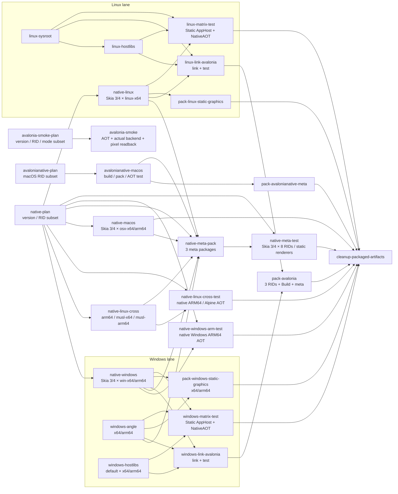

# HostForge 开发与构建指南

本文面向仓库维护者和希望从源码构建 HostForge 的开发者。包的消费方式请从根目录 [README](README.md) 进入对应包文档。

除非特别说明，以下命令都在仓库根目录执行。

## 版本来源

- [`native/hostlibs`](native/hostlibs)
- [`native/skiasharp`](native/skiasharp)
- [`native/angle`](native/angle)
- [`native/avalonianative`](native/avalonianative)
- [`Directory.Build.props`](Directory.Build.props)


## 环境要求

通用要求：

- .NET 10 SDK
- Python 3.11+
- [uv](https://docs.astral.sh/uv/)
- Task 3.52.0+
- Git
- Ninja
- CMake
- LLVM / Clang

Windows 构建环境：

- Windows 11
- MSVC Build Tools 14.50（VS 2026）
- Windows SDK 10.0.26100
- [LLVM](https://github.com/llvm/llvm-project/releases/download/llvmorg-21.1.8/LLVM-21.1.8-win64.exe) ，默认路径为 `C:\Program Files\LLVM`
- [depot_tools](https://chromium.googlesource.com/chromium/tools/depot_tools.git) ，配置环境变量

Linux 构建使用 Clang，并通过 sysroot 对齐 .NET Host、SkiaSharp 和 HarfBuzzSharp 的目标 ABI。背景和工具链说明见 [Linux 构建方法](docs/roadmap/2026-03-13-linux-build-methodology.md)。

macOS 的 SkiaSharp 构建需要 Command Line Tools；AvaloniaNative 构建需要完整的 Xcode 26.0.1。

## 上游源码

无需预先检出上游仓库。Conan 在首次构建 recipe revision 时浅检出固定 commit，并将配置无关的源码保存在 source cache；每个 binary configuration 使用独立 build folder。每个 binary 使用隔离的源码副本，避免架构或 PGO flavor 共用输出；GN 输出与源码保持固定的相对布局，使 Conan build folder 的 hash 变化不影响编译缓存。

## 构建入口

根目录 [`Taskfile.yml`](Taskfile.yml) 是常用任务入口：

| 命令 | 作用 |
| --- | --- |
| `build-hostlibs` | 构建 .NET AppHost / SingleFileHost 静态库；`JOBS` 控制 Ninja 并发 |
| `build-skiasharp` | 构建 SkiaSharp / HarfBuzzSharp 静态库；`SKIASHARP_VERSION=3.119.4\|4.153.1`、`RID`、`SYSROOT`、`JOBS` 可选，默认保持 3.119.4；macOS 支持 `RID=osx-x64\|osx-arm64`，使用 CLT + GN，最多 4 并发 |
| `pack-graphics-meta` | 打包 SkiaSharp / Angle / Avalonia.Native 元包（依赖该组件全部支持 RID） |
| `build-angle` | 构建 Windows x64 / arm64 ANGLE 静态库 |
| `build-avalonianative` | 用 Xcode 26.0.1 构建 macOS AvaloniaNative（RID=osx-x64\|osx-arm64，AVALONIA_VERSION=12.1.3） |
| `pack-avalonianative` | 打包单个 AvaloniaNative RID；PACKAGING_REVISION 指定第四段修订号 |
| `pack-avalonianative-meta` | 打包精确依赖两个 macOS RID 包的 AvaloniaNative 元包 |
| `test-avalonianative` | 验证版本与 AOT/RID 门控；macOS 上发布并运行窗口和字体测试 |
| `matrix` | 运行 Static AppHost 与 NativeAOT 集成矩阵 |
| `matrix-nativeaot` | 打包本地静态图形库并验证 NativeAOT 发布与运行 |
| `link-avalonia` | 生成指定操作系统的 Avalonia 宿主模板 |
| `avalonia-test` | 运行 Avalonia AppHost 集成测试 |
| `pack-avalonia` | 打包全部 Avalonia AppHost（RID 包 + Build + 元包） |
| `pack-avalonia-rid` | 打包单个 RID 的 Avalonia AppHost 模板（RID=win-x64\|win-arm64\|linux-x64） |
| `pack-avalonia-build` | 打包 Build 包（targets + ModuleInitializer） |
| `pack-avalonia-meta` | 打包元包（依赖所有子包） |
| `pack-static-apphost` | 打包通用 Static AppHost |
| `pack-skia-static` | 按 `RID` 与 `SKIASHARP_VERSION` 打包 SkiaSharp 静态库输入 |
| `pack-angle-static` | 打包 Windows ANGLE 静态库输入（win-x64 或 win-arm64） |

运行 `task --list` 可查看任务；通过 `NAME=value` 传入目标平台、RID 或打包模式。构建任务接受 `ARCH=x64|arm64`、`PGO=true|false`，Linux 构建还需传入 `SYSROOT`。

## Windows 构建

### 1. 构建 HostLibs

Windows 支持以下组合：

- `default`：`win-x64`、`win-arm64`
- `no-pgo`：`win-x64`、`win-arm64`

```powershell
task build-hostlibs ARCH=x64
task build-hostlibs ARCH=arm64
task build-hostlibs ARCH=x64 PGO=false  # no-pgo flavor
```

`CONAN_HOME` 设为 `build/conan` 的绝对路径。本地构建前先 `export CONAN_HOME=$(pwd)/build/conan`（或 PowerShell: `$env:CONAN_HOME = "$PWD\build\conan"`）。

### 2. 构建 SkiaSharp / HarfBuzzSharp

```powershell
task build-skiasharp ARCH=x64
task build-skiasharp ARCH=arm64
```

Windows HarfBuzzSharp 项目由 [`scripts/libHarfBuzzSharp.vcxproj.in`](scripts/libHarfBuzzSharp.vcxproj.in) 原样导出后实例化，仓库中的上游模板不由 recipe 修改。

### 3. 构建 ANGLE

先将 Chromium `depot_tools` 加入 `PATH`，然后运行：

```powershell
task build-angle ARCH=x64
task build-angle ARCH=arm64
```

recipe 的职责和包内容详见 [`native/angle/README.md`](native/angle/README.md)。

### 4. 生成并验证 Avalonia 宿主

```powershell
task link-avalonia TARGET_OS=windows
task avalonia-test
```

`avalonia-test` 会按需打包平台 RID 包和 Build 包，并验证模板激活、动态本机库抑制、Windows ANGLE P/Invoke 从宿主解析和可执行文件运行行为。

### 5. 打包

```powershell
task pack-avalonia
task pack-static-apphost RID=win-x64
task pack-skia-static RID=win-x64
task pack-skia-static RID=win-arm64
task pack-angle-static RID=win-x64
task pack-angle-static RID=win-arm64
task matrix-nativeaot
```

`pack-avalonia` 依次打包所有 RID 包、Build 包和元包。也可单独打包某个 RID：`task pack-avalonia-rid RID=win-x64`。详细约定见 [Avalonia 打包说明](src/package-avalonia-apphost/DEVELOPMENT.md)。

## Linux 构建

HostLibs / AppHost 模板保持 `linux-x64`；NativeAOT 静态图形包支持 `linux-x64`、`linux-arm64`、`linux-musl-x64`、`linux-musl-arm64`。

### 1. 构建 HostLibs

```bash
task build-hostlibs SYSROOT=build/rootfs/x64
```

使用 `native/hostlibs/profiles/linux-x64`，通过 `ROOTFS_DIR` 环境变量传入 sysroot。CI 同时启用 Conan system package manager 安装 Runtime 声明的 Ubuntu 构建依赖。不指定 SYSROOT 时使用系统原生工具链。

### 2. 构建 SkiaSharp / HarfBuzzSharp

```bash
task build-skiasharp SYSROOT=build/rootfs/x64
task pack-skia-static RID=linux-x64
task matrix-nativeaot
```

使用 `native/skiasharp/profiles/linux-x64`，同样通过 `ROOTFS_DIR` 环境变量传入 sysroot；可继续用 `CC`、`CXX` 和 `AR` 覆盖 GN 工具链命令。

其它 Linux RID 使用对应的 amd64 cross 镜像；`SYSROOT` 的末级目录为 `x64` 或 `arm64`，所有 Skia 编译均在 amd64 宿主执行。例如：

```bash
docker build -f native/skiasharp/linux-musl-arm64.Dockerfile -t hostforge-skia .
docker run --rm -v "$PWD:/work" hostforge-skia task build-skiasharp RID=linux-musl-arm64 SKIASHARP_VERSION=4.153.1 SYSROOT=/crossrootfs/arm64 JOBS=4
task pack-skia-static RID=linux-musl-arm64 SKIASHARP_VERSION=4.153.1
```

### 3. 生成并验证 Avalonia 宿主

```bash
task link-avalonia TARGET_OS=linux SYSROOT=build/rootfs/x64
task avalonia-test SYSROOT=build/rootfs/x64
```

### 4. 验证通用链接流程

```bash
dotnet run --project samples/simple-pinvoke/SimplePInvoke.csproj
dotnet publish samples/simple-pinvoke/SimplePInvoke.csproj -p:PublishTrimmed=true
```

## 测试

Static AppHost 与 NativeAOT 集成矩阵：

```powershell
task matrix
```

`matrix-nativeaot` 会打包当前平台的 SkiaSharp 静态库；Windows 还会打包 ANGLE。随后发布并运行 `samples/nativeaot-matrix`，检查 SkiaSharp、HarfBuzzSharp 和 Windows ANGLE 的原生调用，以及发布目录中没有对应动态本机库。运行前需先构建当前平台的原生库。

可通过环境变量调整矩阵测试：

- `HOSTFORGE_MATRIX_SKIP_EXE_RUN=true`：只构建，不运行生成的可执行文件。
- `HOSTFORGE_MATRIX_NO_CLEAN=true`：保留消费端测试项目的 `bin` / `obj`。

也可在命令行传入对应的 Task 变量：`SKIP_EXE_RUN=true`、`NO_CLEAN=true`。

也可以直接运行测试工程：

```powershell
dotnet test --project .\tests\HostForge.StaticAppHost.Tests\HostForge.StaticAppHost.Tests.csproj -c Release -v:minimal
dotnet test --project .\tests\HostForge.AvaloniaAppHost.Tests\HostForge.AvaloniaAppHost.Tests.csproj -c Release -v:minimal
```

Avalonia 测试包含平台特定用例：Windows 用例在非 Windows 系统跳过，Linux 用例在非 Linux 系统跳过。

## 产物布局

```text
artifacts/
├── hostlibs/<runtime-version>/<flavor>/<rid>/
├── skiasharp/<skiasharp-version>/<rid>/
├── angle/<angle-version>/<rid>/
├── avalonianative/<avalonia-version>/<rid>/
├── avalonia-host/<avalonia-target>/<rid>/
├── packages/<configuration>/
└── tmp/
```

主要目录：

- `hostlibs`：AppHost / SingleFileHost 静态库、响应文件和链接参数。
- `skiasharp`：SkiaSharp / HarfBuzzSharp 及其依赖静态库。
- `angle`：Windows ANGLE complete static libraries 与宿主导出定义文件。
- `avalonianative`：AvaloniaNative 静态库、来源清单与许可证。
- `avalonia-host`：已经链接完成、可直接打包的宿主模板。
- `packages`：生成的 NuGet 包。
- `tmp`：集成测试工作区和临时 NuGet 缓存。

## CI 工作流

<!-- Keep this Mermaid workflow diagram in sync with .github/workflows/build.yml. -->

```mermaid
flowchart LR
    ASP["avalonia-smoke-plan<br/>version / RID / mode subset"] --> AS["avalonia-smoke<br/>AOT + actual backend + pixel readback"]
    ANP["avalonianative-plan<br/>macOS RID subset"] --> AN["avalonianative-macos<br/>build / pack / AOT test"]
    AN --> ANM["pack-avalonianative-meta"]
    ANM --> CLEAN
    NP["native-plan<br/>version / RID subset"] --> NW["native-windows<br/>Skia 3/4 × win-x64/arm64"]
    NP --> NL["native-linux<br/>Skia 3/4 × linux-x64"]
    NP --> NLC["native-linux-cross<br/>arm64 / musl-x64 / musl-arm64"]
    NP --> NLCT["native-linux-cross-test<br/>native ARM64 / Alpine AOT"]
    NLC --> NLCT
    NP --> NM["native-macos<br/>Skia 3/4 × osx-x64/arm64"]
    NP --> NMP["native-meta-pack<br/>3 meta packages"]
    NP --> NWAT
    NW --> NWAT["native-windows-arm-test<br/>native Windows ARM64 AOT"]
    NW --> NMP
    NLC --> NMP
    AN --> NMP
    NL --> NMP
    NM --> NMP
    WA --> NMP
    NP --> NMT["native-meta-test<br/>Skia 3/4 × 8 RIDs / static renderers"]
    NMP --> NMT
    subgraph W["Windows lane"]
        direction LR
        WH["windows-hostlibs<br/>default × x64/arm64"]
        WA["windows-angle<br/>x64/arm64"]
        WPG["pack-windows-static-graphics<br/>x64/arm64"]
        WLA["windows-link-avalonia<br/>link + test"]
        WM["windows-matrix-test<br/>Static AppHost + NativeAOT"]

        WH --> WLA
        NW --> WLA
        WA --> WLA
        NW --> WPG
        WA --> WPG
        WH --> WM
        NW --> WM
        WA --> WM
    end

    subgraph L["Linux lane"]
        direction LR
        LSY["linux-sysroot"]
        LH["linux-hostlibs"]
        LPG["pack-linux-static-graphics"]
        LLA["linux-link-avalonia<br/>link + test"]
        LM["linux-matrix-test<br/>Static AppHost + NativeAOT"]

        LSY --> LH
        LSY --> LLA
        LSY --> LM
        LH --> LLA
        NL --> LLA
        NL --> LPG
        LH --> LM
        NL --> LM
    end

    PA["pack-avalonia<br/>3 RIDs + Build + meta"]
    CLEAN["cleanup-packaged-artifacts"]
    NLCT --> CLEAN

    WLA --> PA
    LLA --> PA
    WPG --> CLEAN
    WM --> CLEAN
    LPG --> CLEAN
    LM --> CLEAN
    PA --> CLEAN
    NMT --> CLEAN
    NM --> CLEAN
    NWAT --> CLEAN
```

| Job | 平台 | 主要输出 |
| --- | --- | --- |
| `avalonia-smoke-plan` | Linux | `components=smoke` 独立诊断的版本、RID、渲染模式矩阵 |
| `avalonia-smoke` | Windows / Linux / macOS | 官方动态原生库的 AOT 窗口渲染、实际 backend、像素读回与提交 JSON；独立于静态库生产 |
| `native-plan` | Linux | dispatch 所选版本与 8 RID 矩阵 |
| `native-windows` | Windows x64 | 两个版本 × 两种架构的静态库、RID 包，以及 x64 AOT / 版本保护 |
| `native-windows-arm-test` | Windows 11 ARM64 | ARM64 NativeAOT 原生发布、实际运行与架构审计 |
| `native-linux` | Linux | 固定 LLVM 20 / bionic sysroot 静态库、RID 包、AOT 运行及 ABI 审计 |
| `native-linux-cross` | Linux x64 | linux-arm64 / musl-x64 / musl-arm64 × 两版本的静态库、RID 包及固定目标 sysroot |
| `native-linux-cross-test` | Linux x64 / ARM64 | glibc ARM64 原生 AOT 与 ABI 审计；musl 在原生 Alpine 容器内发布、运行及解释器审计 |
| `native-macos` | macOS 15 Intel / ARM64 | 两个版本的 Metal + GL 静态库、RID 包、AOT 实际运行、Mach-O 架构 / 部署版本审计 |
| `native-meta-pack` | Linux | 依赖全部 RID 的正式元包、消费 feed 与包体积审计 |
| `native-meta-test` | Windows / Linux / macOS 的原生 x64 / ARM64 | 三元包、无 RID build、16 个发布运行单元、ABI 审计；静态 ANGLE / Vulkan / EGL / GLX 与 macOS 绘制证明 |
| `avalonianative-plan` | Linux | `components=avalonianative` 或 `all` 时选择 macOS RID |
| `avalonianative-macos` | macOS 15 ARM64 / Intel，Xcode 26.0.1 | AvaloniaNative RID 包、AOT 窗口/字体与链接测试结果 |
| `pack-avalonianative-meta` | Linux | 两个 macOS RID 都构建后生成精确版本元包 |
| `windows-hostlibs` | Windows | 两种架构的 HostLib 缓存 |
| `windows-angle` | Windows | `win-x64` / `win-arm64` ANGLE 静态库缓存 |
| `pack-windows-static-graphics` | Windows | 两种架构的 SkiaSharp 与 ANGLE 静态 NuGet 包 |
| `windows-matrix-test` | Windows | Static AppHost 与 win-x64 NativeAOT 集成验证 |
| `windows-link-avalonia` | Windows | Windows Avalonia 模板及测试结果 |
| `linux-sysroot` | Linux | Skia / HostLibs / AppHost 共用的 cross 镜像 bionic rootfs 缓存 |
| `linux-hostlibs` | Linux | `linux-x64` HostLib 缓存 |
| `pack-linux-static-graphics` | Linux | `linux-x64` SkiaSharp 静态 NuGet 包 |
| `linux-matrix-test` | Linux | Static AppHost 与 linux-x64 NativeAOT 集成验证 |
| `linux-link-avalonia` | Linux | Linux Avalonia 模板及测试结果 |
| `pack-avalonia` | Windows | 3 个 RID 包 + Build 包 + 元包（ChsBuffer.Avalonia.AppHost） |
| `cleanup-packaged-artifacts` | Linux | 所有消费 job 成功后删除已打包的中间工件 |

## 缓存约定

手工运行用 `components=all|skiasharp|avalonianative|smoke`、`skia_version=all|3.119.4|4.153.1` 和 `rid=all|<8 个支持 RID 之一>` 选择子集。完整运行聚合正式元包并在 8 个原生 RID 上验收；RID 子集只生成对应单元。`components=all` 保留 AppHost 构建与回归测试。musl 测试在对应架构的 Alpine 容器中执行；macOS runner 无 Metal 设备时验收 Software，并保存检测记录。包与验收证据保留 7 天（独立 AvaloniaNative 包为 14 天），跨 job sysroot 保留 3 天。

原生库产物键按组件、版本、RID、实际工具链版本，以及对应 recipe 核心 / 平台模块 / profile / Dockerfile / 校验和与相关 Task 片段生成。版本表只读取当前版本条目；无关 Task、其它平台 profile 和 Python 项目元数据不参与。AppHost 与 NativeAOT 共享 SkiaSharp 3.119.4 产物。`native-plan` 运行 `tests/native` 的缓存键边界测试。

产物 miss 时恢复同组件、版本、RID、工具链前缀的编译缓存。Skia、HarfBuzz、ANGLE 和 HostLibs 使用 sccache 0.18，关闭直接模式。HostLibs 保留 MSVC 预编译头，只缓存独立对象；Clang 预编译头在当前目录重新生成。AvaloniaNative 使用 ccache depend 模式与正常模块头文件校验。单元上限：Windows Skia 128 MiB、ANGLE 64 MiB、Windows HostLibs 256 MiB、Linux HostLibs 512 MiB、Linux / macOS Skia 64 MiB、AvaloniaNative 32 MiB，合计 2.44 GiB；另为产物、目标 sysroot 和工具缓存留出空间。旧输入代际由 Actions LRU 回收，构建统计保存在 `cache-stats-*` artifact。

`cache_mode=normal|rebuild|cold` 分别使用全部缓存、只使用编译缓存、忽略两层缓存，可用于重建与缓存问题诊断。Linux 热命中直接恢复压缩目标 rootfs，不拉取 cross 镜像；HostLibs 和 AppHost 链接也使用这一份 bionic rootfs。`components=smoke` 保留独立的官方动态库诊断，可比较静态链接前后的后端行为；默认运行只验收静态包。

同一 ref 的新运行取消旧运行，main 的发布性运行使用独立并发组，避免运行中或排队中的发布被取消。无论产物命中与否都上传 workflow artifact；消费 job 成功后删除 `native-skia-*`、`native-rootfs-*`、`angle-*` 和 `avalonia-host-*`，保留 NuGet 包、证据及 `hostlibs-default-*`。失败时保留中间产物供重跑。

## 仓库结构

```text
src/        MSBuild 链接逻辑和包工程
native/     原生依赖的 Conan recipe、profile 和 deployer
scripts/    项目直接使用的工具和上游模板
samples/    Avalonia 与简单 P/Invoke 示例
tests/      TUnit 集成测试及共享测试基础设施
docs/       设计、方法论和路线文档
build/      Conan cache、sysroot 等构建期目录
artifacts/  构建、打包和测试输出
```

更具体的测试说明分别位于：

- [Static AppHost tests](tests/HostForge.StaticAppHost.Tests/README.md)
- [Avalonia AppHost tests](tests/HostForge.AvaloniaAppHost.Tests/README.md)
- [NativeAOT static graphics tests](tests/HostForge.NativeAot.Tests/README.md)
- [AvaloniaNative tests](tests/HostForge.AvaloniaNative.Tests/README.md)
- [Test infrastructure](tests/HostForge.TestInfra/README.md)
