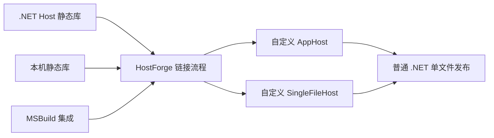

# HostForge

[](https://www.nuget.org/packages/ChsBuffer.Avalonia.AppHost/)

无需 NativeAOT，也能发布不解压本机库的 .NET 单文件应用。

HostForge 将本机静态库重新链接进 .NET `AppHost` / `SingleFileHost`，替换 SDK 默认宿主，从而避免 `IncludeNativeLibrariesForSelfExtract` 带来的运行时解包。

## 项目组件

| 组件 | 用途 | 当前支持 |
| --- | --- | --- |
| [`ChsBuffer.Avalonia.AppHost`](https://www.nuget.org/packages/ChsBuffer.Avalonia.AppHost/) | 已预链接 SkiaSharp / HarfBuzzSharp 的 Avalonia 宿主模板 | Avalonia 12、.NET 10；`win-x64`、`win-arm64`、`linux-x64` |
| [`ChsBuffer.AppHost.Static.win-x64`](https://www.nuget.org/packages/ChsBuffer.AppHost.Static.win-x64/) | 在普通 .NET 项目的构建/发布过程中重新链接宿主 | .NET 10、`win-x64` |
| [`ChsBuffer.SkiaSharp.Static.win-x64`](https://www.nuget.org/packages/ChsBuffer.SkiaSharp.Static.win-x64/) | 提供 SkiaSharp / HarfBuzzSharp 静态链接输入 | `win-x64` |

当前构建基线：

| 依赖 | 版本 |
| --- | --- |
| Avalonia | 12.1.0 |
| .NET Runtime | 10.0.10 |
| SkiaSharp | 3.119.4 |
| HarfBuzzSharp | 8.3.1.5 |

项目仍处于预览阶段，包版本和构建接口可能继续调整。

## 工作原理



应用仍使用常规 .NET 构建和单文件发布流程；HostForge 只替换宿主生成方式，不要求启用 NativeAOT。

## Avalonia 快速开始

在 Avalonia 项目中引用宿主包，并启用单文件发布：

```xml
<PropertyGroup>
  <PublishSingleFile>true</PublishSingleFile>
</PropertyGroup>

<ItemGroup>
  <PackageReference Include="ChsBuffer.Avalonia.AppHost" Version="12.0.0-preview.5" />
</ItemGroup>
```

然后正常发布：

```bash
dotnet publish -c Release
```

当目标框架和 RID 存在匹配模板时，包会自动替换 `AppHost` 与 `SingleFileHost`，注入本机库解析器，并从发布目录移除动态 SkiaSharp / HarfBuzzSharp 本机库。

完整行为和可选开关见 [Avalonia AppHost 包文档](src/package-avalonia-apphost/README.md)。通用静态链接用法见 [Static AppHost 包文档](src/package-apphost-static/README.md)。

## 文档与示例

- [开发与构建指南](DEVELOPMENT.md)
- [Avalonia 打包说明](src/package-avalonia-apphost/DEVELOPMENT.md)
- [Avalonia 示例](samples/avalonia-sample/README.md)
- [简单 P/Invoke 示例](samples/simple-pinvoke)
- [设计与路线文档](docs/roadmap)

## License

[MIT](LICENSE.TXT)
